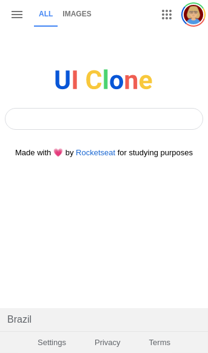

<h1 align="center">Google Homepage</h1>
<p align="center">Google Homepage Mobile Design developed in HTML5 and CSS3. This project was developed based on a video from rocketseat.
</br>
<a href="https://www.youtube.com/watch?v=KgjzE1Sxtq0">Access Video</a>
</p>

<p align="center">
  

  

  

  
</p>

<p align="center">
  <a href="#rocket-about">About</a>
  &nbsp;&nbsp;&nbsp;|&nbsp;&nbsp;&nbsp;
  <a href="#memo-license">License</a>
</p>

<p align="center">
  
</p>

---

### :rocket: About
Project information

:heavy_check_mark: Project developed with the following technologies:
* HTML5
* CSS3

:heavy_check_mark: Clone the project with the command:

```sh
git clone https://github.com/ale-mouraboni/clone-google-homepage-html-css.git
```  
  
:heavy_check_mark: Or download the .zip file:  
  
* [Download Project](https://github.com/ale-mouraboni/clone-google-homepage-html-css/archive/refs/heads/main.zip)

---

### :memo: License
This project is under the MIT license. See the [LICENSE] for more information.

---
