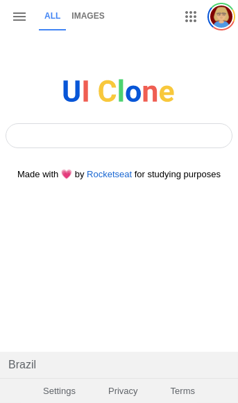

<div align="center">



</div>

---

<div style="text-align: justify">

### Descrição
Design Mobile do Google desenvolvido em HTML5 e CSS3.
Esse projeto foi desenvolvido com base em um vídeo da Rocketseat 

</div>

#### Link da Plataforma:

* [Rocketseat](https://rocketseat.com.br/)

Esse projeto foi desenvolvido com as seguintes tecnologias:
* HTML5
* CSS3

Para ver o projeto você pode clonar ele com o seguinte comando:    

```sh
git clone https://github.com/ale-mouraboni/clone-google-homepage-html-css.git
```  
  
Você também pode baixar o arquivo .zip do projeto, basta clicar no botão abaixo.  
  
* [Baixar Projeto](https://github.com/ale-mouraboni/clone-google-homepage-html-css/archive/refs/heads/main.zip)

---

### License
This project is under the MIT license. See the [LICENSE] for more information.

---
